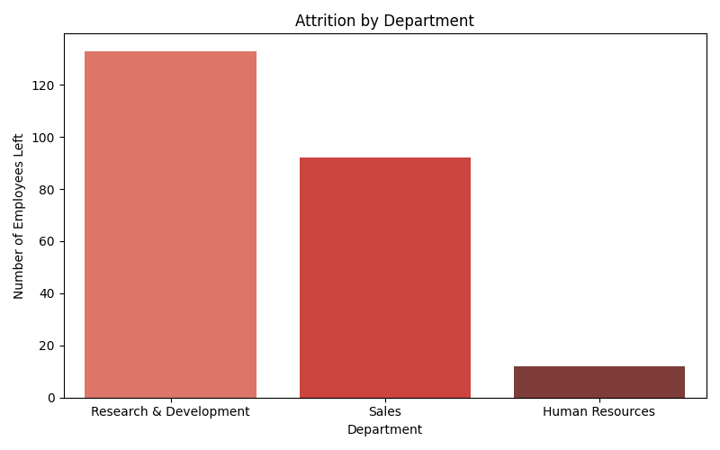
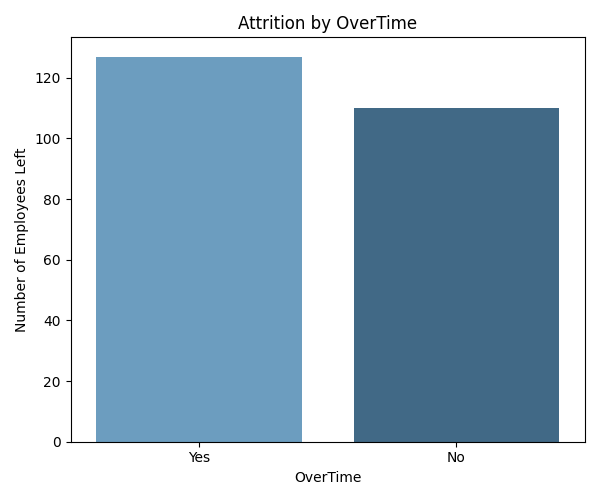
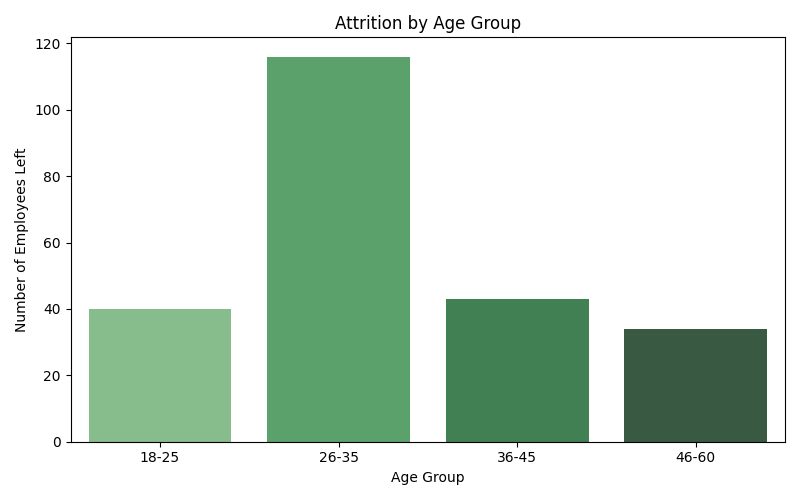
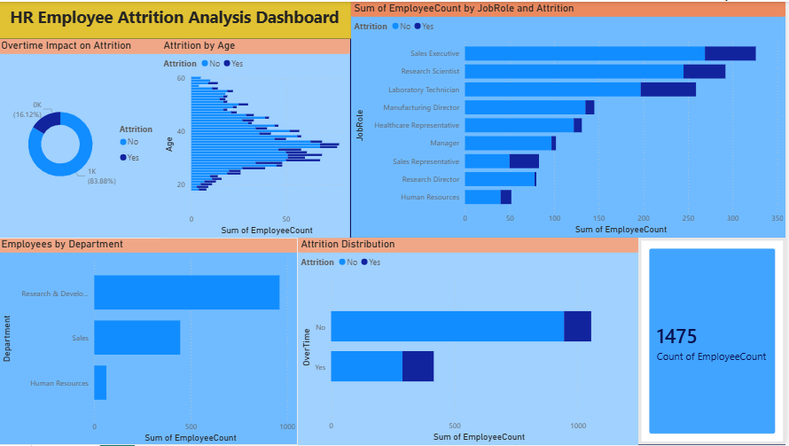

# HR Employee Attrition Analysis

## Business Problem
A company is losing employees at a 16.12% attrition rate. 
This project analyzes why employees are leaving and identifies high-risk groups.

## Tools Used
- Python (Pandas, Matplotlib, Seaborn)
- SQL Server (SSMS)
- Power BI
- Excel

## Dataset
- IBM HR Analytics Dataset
- 1,470 employee records
- 35 features

## Key Findings
- Overall Attrition Rate: 16.12% (237 out of 1,470 employees)
- Sales department has highest attrition rate (20%)
- Employees working OverTime are 3x more likely to leave
- Employees who left had lower average salary (₹4,787 vs ₹6,832)
- Age group 26-35 has highest attrition count (116 employees)
- R&D department recorded highest exits (133 employees)

## Project Structure
- hr_attrition_eda.py — Python EDA and visualizations
- hr_attrition_queries.sql — SQL analysis queries
- Attrition_dashboard.pbix — Power BI dashboard
- Charts — PNG visualizations

## Visualizations

